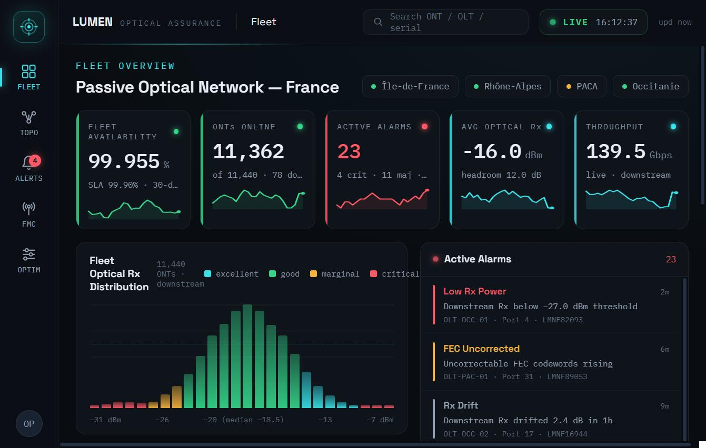

# LUMEN PON Optical Assurance (France)

**[Open the live dashboard](https://arausi450.github.io/lumen-pon-assurance/)**

A fleet-scale monitoring dashboard for a French passive optical access network (GPON and XGS-PON). I built it as a portfolio piece. Its analytics view is driven by my own research on upstream-delay prediction, so that part is not a mock-up. The feature-importance figures and the dataset behind them come from my own work.

## The OPTIM View

OPTIM is a model-driven view of upstream delay. The feature-importance bars are the actual values from my research (FIR 81.9%, DR 14.4%), and the model is trained on 44,213 samples, one every 12 minutes, with 88 KPIs per direction. The FMC view then puts that model to work. It shows a 24-hour chart of predicted versus measured upstream delay with the model band drawn in, and a warning fires when a congestion spike pushes delay across the 1 ms bound. This is the thread that ties the dashboard to real analysis rather than a wall of gauges.

## The Rest of the Dashboard

- **Fleet.** Fleet-wide health across Île-de-France, Rhône-Alpes, PACA and Occitanie. It shows availability against a 30-day SLA, ONTs online, active alarms by severity, average optical Rx with headroom and live downstream throughput. An Rx-power distribution covers the full ONT base (median around −18.5 dBm), and the OLT table drills into any of the 12 line terminals.
- **Topology.** The PON tree from OLT through the splitter to the ONTs, with upstream TDMA bursts animated in grant order.
- **Alerts.** A live, rule-driven alarm feed across critical, major and minor levels. The rules include pre-FEC BER above 1e-4 held for 30 seconds and Loss of Signal.

## Scale

12 OLTs, roughly 11,440 ONTs and 4 French regions.

## Tech

HTML, CSS and JavaScript with no backend. The page runs on a small runtime file, support.js, which loads React in the browser. Telemetry is simulated in the browser and updates live. To run it locally, keep index.html and support.js in the same folder and open index.html with an internet connection.

## A Note on the Data

The device readings and alarms are simulated for demonstration and are not wired to production hardware. The alarm rules (pre-FEC BER above 1e-4, Loss of Signal and so on) are the real ones. The OPTIM figures come from my own dataset and model, as noted above.

## Background

I built this from my optical-access and fronthaul work (GPON and XGS-PON, DWDM, FTTA, transmission) and the upstream-delay modelling behind the OPTIM view. The aim was to show a PON assurance tool end to end, from fleet health down to a model that predicts something real.
